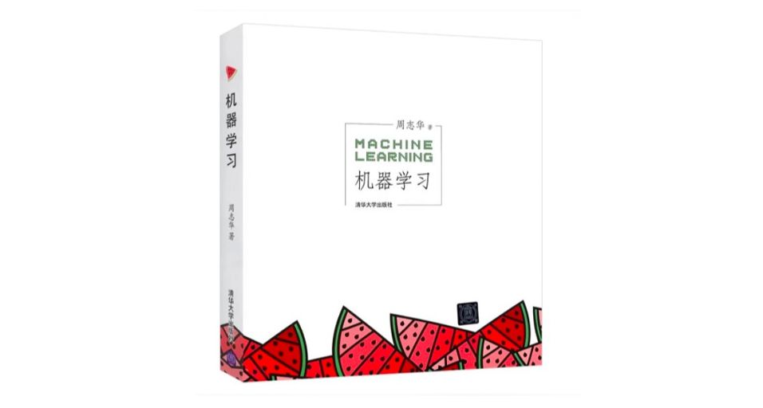

# 周志华老师"西瓜书"《机器学习》课后习题中的编程题


这里存放我学习周志华老师“西瓜书“《机器学习》课后习题中的编程题.

## 设置运行环境

本项目使用[Python3\(3.10.8\)](https://www.python.org/downloads/)开发, 在设置项目前请确保已正确按照和配置了Python3. 建议使用[venv](https://docs.python.org/zh-cn/3/library/venv.html)进行项目环境隔离.

克隆项目到本地:  

```bash
 ~/temp $ git clone https://github.com/liyue2008/xiguashu.git
Cloning into 'xiguashu'...
remote: Enumerating objects: 83, done.
remote: Counting objects: 100% (83/83), done.
remote: Compressing objects: 100% (53/53), done.
remote: Total 83 (delta 39), reused 66 (delta 25), pack-reused 0
Receiving objects: 100% (83/83), 29.17 KiB | 489.00 KiB/s, done.
Resolving deltas: 100% (39/39), done.
```

进入克隆目录, 创建并激活venv:

```bash
 ~/temp $ cd xiguashu
 ~/temp/xiguashu $ python3 -m venv .
 ~/temp/xiguashu $ ls
LICENSE          data             lib              tests
README.md        decision_tree    pyvenv.cfg
bin              include          requirements.txt
 ~/temp/xiguashu $ source bin/activate
(xiguashu)  ~/temp/xiguashu $ # 注意到命令提示符变了，有个(xiguashu)前缀，表示当前环境是一个名为xiguashu的Python环境
```

安装项目所需的第三方包:

```bash
(xiguashu)  ~/temp/xiguashu $ pip3 install -r requirements.txt
```

至此环境已经设置好了. 执行一个单元测试验证一下:

```bash
(xiguashu) ~/temp/xiguashu $ python3 tests/decision_tree_test.py
.........
----------------------------------------------------------------------
Ran 9 tests in 0.096s

OK
```

## 第四章 决策树

这一章的习题都放在decision_tree目录下, 目录结构如下:

```bash
(xiguashu)  ~/temp/xiguashu $ tree decision_tree
decision_tree
├── __init__.py
├── decision_tree_base.py # 决策树学习基本算法的实现, 对应书中P74 图 4.2
├── gain.py # 对应习题4.3, 用信息增益来进行决策树的最优划分属性选择, 采用二分法(bi-partition)对连续属性进行处理的决策树生成算法实现.
└── gini.py # 用基尼指数来进行决策树的划分属性选择的决策树生成算法实现.
```

### 4.3 试编程实现基于信息嫡进行划分选择的决策树算法，并为表4.3中数据生成一棵决策树.  

用信息增益来进行决策树的最优划分属性选择, 采用二分法(bi-partition)对连续属性进行处理的决策树生成算法实现.

```bash
(xiguashu)  ~/workspace/xiguashu $ python3 -m decision_tree.gain   
输入-数据集 D:
TrainingSet: label_name=好瓜, samples(17):
    色泽  根蒂  敲声  纹理  脐部  触感     密度    含糖率 好瓜
编号                                         
1   青绿  蜷缩  浊响  清晰  凹陷  硬滑  0.697  0.460  是
2   乌黑  蜷缩  沉闷  清晰  凹陷  硬滑  0.774  0.376  是
3   乌黑  蜷缩  浊响  清晰  凹陷  硬滑  0.634  0.264  是
4   青绿  蜷缩  沉闷  清晰  凹陷  硬滑  0.608  0.318  是
5   浅白  蜷缩  浊响  清晰  凹陷  硬滑  0.556  0.215  是
6   青绿  稍蜷  浊响  清晰  稍凹  软粘  0.403  0.237  是
7   乌黑  稍蜷  浊响  稍糊  稍凹  软粘  0.481  0.149  是
8   乌黑  稍蜷  浊响  清晰  稍凹  硬滑  0.437  0.211  是
9   乌黑  稍蜷  沉闷  稍糊  稍凹  硬滑  0.666  0.091  否
10  青绿  硬挺  清脆  清晰  平坦  软粘  0.243  0.267  否
11  浅白  硬挺  清脆  模糊  平坦  硬滑  0.245  0.057  否
12  浅白  蜷缩  浊响  模糊  平坦  软粘  0.343  0.099  否
13  青绿  稍蜷  浊响  稍糊  凹陷  硬滑  0.639  0.161  否
14  浅白  稍蜷  沉闷  稍糊  凹陷  硬滑  0.657  0.198  否
15  乌黑  稍蜷  浊响  清晰  稍凹  软粘  0.360  0.370  否
16  浅白  蜷缩  浊响  模糊  平坦  硬滑  0.593  0.042  否
17  青绿  蜷缩  沉闷  稍糊  稍凹  硬滑  0.719  0.103  否

输入-属性集 A:
{Continuous attribute: name=密度, Discrete attribute: name=色泽, values={'乌黑', '青绿', '浅白'}, Continuous attribute: name=含糖率, Discrete attribute: name=敲声, values={'清脆', '浊响', '沉闷'}, Discrete attribute: name=纹理, values={'清晰', '模糊', '稍糊'}, Discrete attribute: name=根蒂, values={'蜷缩', '稍蜷', '硬挺'}, Discrete attribute: name=脐部, values={'稍凹', '凹陷', '平坦'}, Discrete attribute: name=触感, values={'软粘', '硬滑'}}

输出-决策树:
Classify(分类属性): 纹理, children(3):
|--纹理=清晰: Classify(分类属性): 密度, children(2):
  |--密度=0.382-: Label(标记值): 否
  |--密度=0.382+: Label(标记值): 是
|--纹理=模糊: Label(标记值): 否
|--纹理=稍糊: Classify(分类属性): 密度, children(2):
  |--密度=0.560-: Label(标记值): 是
  |--密度=0.560+: Label(标记值): 否
```

### 4.4 试编程实现基于基尼指数进行划分选择的决策树算法，为表4.2中数据生成预剪枝、后剪枝决策树，并与未剪枝决策树进行比较
